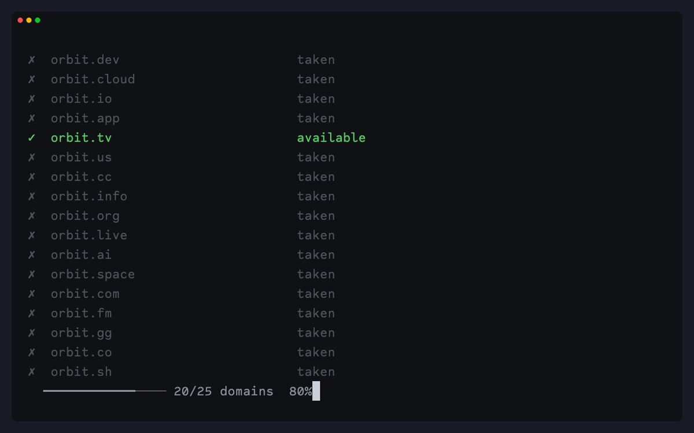

# dibs

[](https://github.com/sitapix/dibs/actions/workflows/ci.yml)
[](https://github.com/sitapix/dibs/releases/latest)
[](https://pkg.go.dev/github.com/sitapix/dibs)
[](https://goreportcard.com/report/github.com/sitapix/dibs)
[](https://opensource.org/licenses/MIT)

**Check domain availability across every ICANN TLD, right from your terminal.**



dibs checks if a domain is available across all 1400+ ICANN TLDs, or against a single domain like `bas.il` or `foo.co.uk`. It queries DNS over HTTPS instead of scraping WHOIS, and `--verify` cross-checks results against registry data via RDAP.

## Installation

Pre-built binaries are available for macOS (arm64, amd64) and Linux (amd64, arm64).

### Homebrew (macOS and Linux)

```bash
brew install sitapix/dibs/dibs
```

### Shell installer

Downloads the latest binary, verifies its checksum, and installs it:

```bash
curl -fsSL https://raw.githubusercontent.com/sitapix/dibs/main/install.sh | bash
```

Or review the script first:

```bash
curl -fsSL https://raw.githubusercontent.com/sitapix/dibs/main/install.sh -o install.sh
less install.sh
bash install.sh
```

### From source

Requires Go 1.26+.

```bash
git clone https://github.com/sitapix/dibs.git
cd dibs
make build
```

Or with `go install`:

```bash
go install github.com/sitapix/dibs@latest
```

### Download binary

Grab the latest binary for your platform from the [releases page](https://github.com/sitapix/dibs/releases), then:

```bash
chmod +x dibs-*
sudo mv dibs-* /usr/local/bin/dibs
```

## Usage

```bash
# check top 25 popular TLDs
dibs orbit

# check ALL 1400+ TLDs
dibs --all orbit

# check one specific domain (single-domain mode: any argument with a dot)
dibs bas.il
dibs foo.co.uk

# verify a specific domain against registry data
dibs bas.il --verify

# verify available domains from a sweep
dibs --verify orbit

# both
dibs --all --verify orbit

# only show available domains
dibs --quiet orbit

# interactive mode (prompts for domain name)
dibs
```

### Output formats

```bash
# JSON (for scripting)
dibs --json orbit

# CSV (for spreadsheets)
dibs --csv orbit

# JSON with verification data
dibs --json --verify orbit

# disable colors (also respects NO_COLOR env var)
dibs --no-color orbit
```

JSON output shape:

```json
{
  "query": "orbit",
  "checked": 25,
  "partial": false,
  "available": [
    { "domain": "orbit.dev", "tld": "dev" }
  ],
  "taken": [
    { "domain": "orbit.com", "tld": "com" }
  ],
  "errors": []
}
```

### Filtering

```bash
# only short TLDs (2-3 characters)
dibs --max-length 3 orbit

# only TLDs with 4+ characters
dibs --min-length 4 orbit

# specific TLDs only
dibs --tlds com,io,dev,app orbit

# sort results
dibs --sort alpha orbit
dibs --sort length orbit

# limit how many TLDs to check
dibs --limit 50 --all orbit
```

### Batch mode

```bash
dibs --file domains.txt
```

`domains.txt` format (one per line, `#` comments supported):
```
orbit
atlas
harbor
```

### Performance

```bash
# increase parallel connections (default: 100, max: 500)
dibs --parallel 200 --all orbit

# adjust timeout per query (default: 5s)
dibs --timeout 3 orbit

# retry failed DNS queries (default: 1)
dibs --retries 3 --all orbit

# force refresh cached TLD list
dibs --refresh --all orbit
```

### DNS providers

```bash
# use Mullvad DoH instead of Quad9 (default)
dibs --provider mullvad orbit

# use another built-in non-registrar resolver
dibs --provider nextdns orbit
dibs --provider adguard orbit

# rotate between all providers
dibs --rotate orbit

# use your own DoH server (for example Cloudflare or Google)
dibs --doh-url https://dns.example.com/dns-query orbit

# use system DNS instead of DoH (faster, plaintext)
dibs --no-doh orbit
```

## Features

- **Single binary, no runtime deps.** Go standard library plus `golang.org/x/net` for Public Suffix List parsing. Nothing else.
- **One domain or many.** `dibs orbit` sweeps the top 25 TLDs; `dibs bas.il` or `dibs foo.co.uk` checks just that domain. Multi-label TLDs like `.co.uk` parse correctly via the Public Suffix List.
- **DNS over HTTPS, padded.** Queries use [RFC 8484](https://datatracker.ietf.org/doc/html/rfc8484) wire format over HTTPS, padded to 128-byte blocks ([RFC 7830](https://datatracker.ietf.org/doc/rfc7830)/[RFC 8467](https://datatracker.ietf.org/doc/rfc8467)) so passive observers can't fingerprint query length by ciphertext size. `User-Agent` is suppressed. Fall back to system DNS with `--no-doh` if you prefer.
- **RDAP verification.** `--verify` cross-checks available domains against the actual registry ([RFC 7480](https://datatracker.ietf.org/doc/html/rfc7480)). Catches domains that are registered but have no DNS set up.
- **Fast.** 100 parallel DNS queries by default, up to 500. Smart defaults check the top 25 TLDs; `--all` sweeps all 1400+ ICANN TLDs.
- **Flexible output.** Terminal with colors and progress bar, JSON, or CSV. Filter by TLD length, sort, limit, or pick specific TLDs.
- **Batch and interactive.** Read domains from a file, or run with no args for an interactive prompt. Drop a config at `~/.config/dibs/config` to set your defaults.

## How it works

### DNS scan

1. Grabs the official TLD list from [IANA](https://data.iana.org/TLD/tlds-alpha-by-domain.txt)
2. Caches it locally for 24 hours (`~/.cache/dibs/tlds.txt`)
3. Fires off parallel DNS A-record lookups via DoH ([RFC 8484](https://datatracker.ietf.org/doc/html/rfc8484) wire format) or system DNS
4. NXDOMAIN means available, NOERROR means taken

DNS is fast but it's really just a first pass. A domain can be registered without having any DNS set up, so it would look available when it's actually not.

### Single-domain mode

When the argument contains a dot (e.g. `bas.il`, `foo.co.uk`), dibs skips the TLD sweep. The [Public Suffix List](https://publicsuffix.org/) (baked into the binary via `golang.org/x/net/publicsuffix`) splits the input correctly, so multi-label TLDs like `.co.uk` and `.com.br` parse as one TLD instead of splitting on the last dot. dibs rejects non-registrable inputs up front: subdomains (`mail.google.com` → use `google.com`), fake TLDs like `.tld`, and PSL private suffixes like `.github.io`. The DNS and RDAP paths are identical to sweep mode. Single-domain mode conflicts with `--all`, `--tlds`, `--file`, `--limit`, `--sort`, and `--min/max-length`.

### RDAP verification (`--verify`)

With `--verify`, dibs goes back and double-checks the domains that DNS said were available:

1. Grabs the [IANA RDAP bootstrap](https://data.iana.org/rdap/dns.json) (also cached for 24 hours)
2. For each "available" domain, asks the TLD's registry directly over HTTPS ([RFC 7480](https://datatracker.ietf.org/doc/html/rfc7480))
3. If the registry says it exists (HTTP 200), it gets corrected to taken. If the registry says it doesn't (HTTP 404), it's confirmed available.

dibs talks to registries directly using the IANA bootstrap files, not through a redirect service. All gTLDs support RDAP, but some ccTLDs don't, so those results stay unverified. See [rdap.org](https://about.rdap.org) if you want to learn more about the protocol.

## Caveats

**A domain can pass both DNS and RDAP checks and still not be available to buy.** Registries can hold names back for premium pricing, trademark protection (TMCH), or other policy reasons without ever creating DNS records or RDAP entries for them. When you go to actually buy one of these, the registrar will either reject it or hit you with a higher price.

Some ccTLDs also restrict second-level registrations to local residents or registered entities (e.g. `.il`, `.ve`), even if the name shows as available in both DNS and RDAP. dibs tells you what's probably available; the registrar always has the final say.

## DoH providers

| Provider | Default | Notes |
|----------|---------|-------|
| **Quad9** | Yes | Non-profit. [quad9.net](https://quad9.net) |
| **Mullvad** | | [mullvad.net](https://mullvad.net/en/help/dns-over-https-and-dns-over-tls) |
| **NextDNS** | | [nextdns.io](https://nextdns.io) |
| **AdGuard** | | Unfiltered endpoint. [adguard-dns.io](https://adguard-dns.io) |

Built-in providers are limited to the non-registrar set above. Use `--doh-url` if you want a different resolver.

Use `--rotate` to spread queries across all four providers, or `--no-doh` to skip DoH entirely and use system DNS (faster, but plaintext).

## Configuration

You can create a config file at `~/.config/dibs/config` to set your defaults:

```
# max concurrent DNS queries (default: 100, max: 500)
parallel=100

# DNS query timeout in seconds (default: 5)
timeout=5

# retry count on error (default: 1)
retries=1

# DoH provider: quad9, mullvad, nextdns, adguard (default: quad9)
provider=quad9
```

Only the keys shown above are supported. Unknown keys produce an error.
CLI flags override config file values.

## Contributing

Contributions are welcome! Check out [CONTRIBUTING.md](CONTRIBUTING.md) for guidelines.

## License

MIT License. See [LICENSE](LICENSE) for details.
